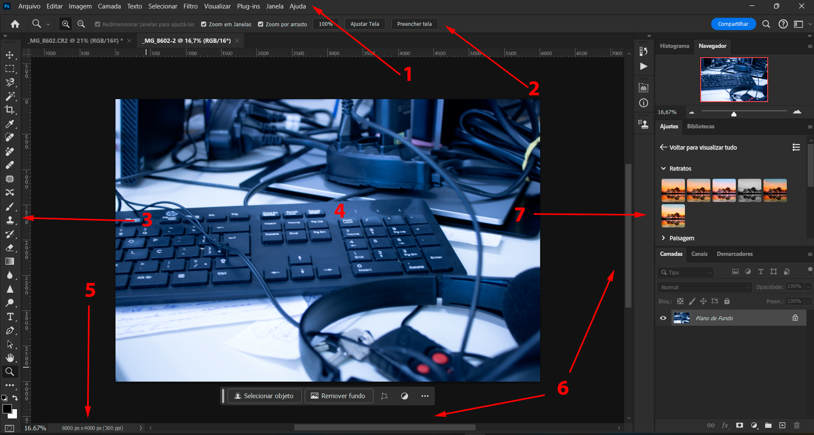

# Introdução

1. Menu principal
2. Barra de controle
3. Barras de ferramentas
4. Área de trabalho
5. Barra de status/informações
6. Barras de rolagem
7. Módulos auxiliares

**Tipos de áreas de Trabalho**  
+ Essenciais
+ Gráfico e Web
+ Movimeto
+ Pintura
+ Fotografia

**Uso Básico do mouse**
+ 1 click - seleciona o ícone
+ 1 click + manter pressionado - abre outras opções do ícone
+ 2 click - expande/recolhe abas
