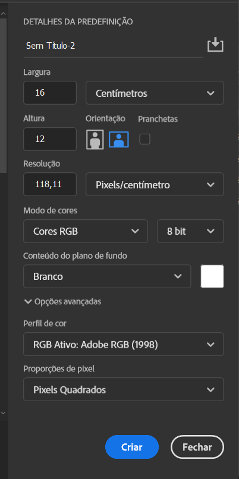

# Tipos de Documentos

**Largura**:   
**Altura**:   
**Unidade de medida**:   
**Orientação**:    
**Resolução**:    
**Modo de cores**:    
**Quantidade de bits**:    
**Plano de fundo**:    
**Perfil de cor**:    
**Proporção de pixels**:    

### Foto

### Arte e Ilustração

### Web

### Dispositivos móveis

### Filme e Vídeo

[Home](../README.md)
